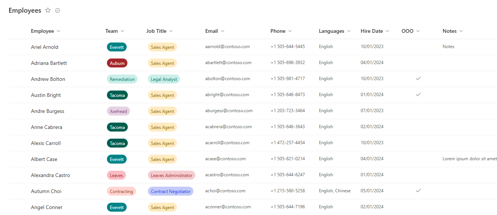
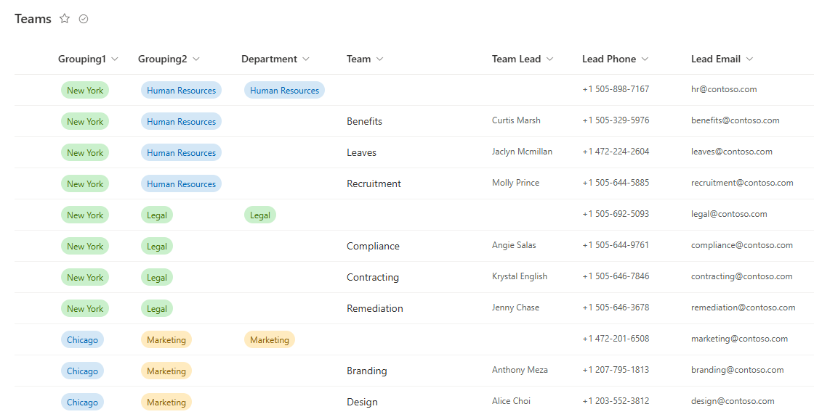

# spfx-wp-slicklist

## Summary

A SharePoint framework webpart for modern SharePoint (SharePoint Online) meant to present a SharePoint lists data in a simple, but responsonsive table for small data sets that are frequently referenced.
- For commonly referenced lists with less than 5000 entries.
- Loads the entire list and caches in local storage, filters client side for very fast lookups.
- Allows selection of Lists on other sites on the same tenant.
- Allows hiding columns based on three configurable media queries for mobile, tablet and desktop.
- Clicking entries displays a modal window showing all columns, even ones hidden from list display by media queries.
- Column filter fields are determined by column data type.
- Can merge data from two lists via lookup column to allow normalization of large lists.
- Can show or hide the normalized list. If hidden the information will still be shown in the modal pop-up window.
- Works with lists and document libraries.

[picture of the solution in action, if possible]

## Usage
1. Create a SharePoint list with as many columns as necessary.
2. Column titles (what you name the columns or rename them to after creating them) are used for column names.
3. Column descriptions are used for column title tooltips (displayed when you hover over the column title).
4. To rename the Title column go to **Settings > List Settings**, then click "Title" under Columns and change the column name.
5. To rearrange the order of columns go to **Settings > List Settings**, then click "Column Ordering."
6. Columns added beyond the Desktop Visible Columns attribute will not show in the webpart list but will show in the modal popup. If you do not wish a column to show anywhere in the webpart, simply hide if from the All Items view in the SharePoint list.
7. Optionally normalize data from your first list into a second list and link them together via a lookup column: 

8. Add the `spfx-wp-slicklist.sppkg` to your SharePoint App Catalog and enable it on any sites you wish to add it to.
9. Edit a SharePoint page and select the new Slicklist webpart.
10. Configure the webpart by choosing at least one list to display
11. Optionally modify the default number of columns displayed for mobile, tablet and destop seperately for each table.
12. Optionally group and order the second table. Fields you choose to group and order by will not show in the modal window display to avoid redundancy.
13. Optionally hide the second table. Lookup data will continue to show in the modal window for Table 1 items.

## Used SharePoint Framework Version

| :warning: Important          |
|:---------------------------|
| Every SPFx version is only compatible with specific version(s) of Node.js. In order to be able to build this sample, please ensure that the version of Node on your workstation matches one of the versions listed in this section. This sample will not work on a different version of Node.|
|Refer to <https://aka.ms/spfx-matrix> for more information on SPFx compatibility.   |

 

## Applies to

- [SharePoint Framework](https://aka.ms/spfx)
- [Microsoft 365 tenant](https://docs.microsoft.com/en-us/sharepoint/dev/spfx/set-up-your-developer-tenant)

## Version history

| Version | Date             | Comments        |
| ------- | ---------------- | --------------- |
| 1.0     | February 25, 2024 | Initial Version |

## Minimal Path to Awesome

- Clone or download this repository
- Run in command line:
  - `npm install` to install the npm dependencies
  - `gulp serve` to display in Developer Workbench (recommend using your tenant workbench so you can test with real lists within your site)
- To package and deploy:
  - Use `gulp bundle --ship` & `gulp package-solution --ship`
  - Add the `.sppkg` to your SharePoint App Catalog

## Disclaimer

**THIS CODE IS PROVIDED _AS IS_ WITHOUT WARRANTY OF ANY KIND, EITHER EXPRESS OR IMPLIED, INCLUDING ANY IMPLIED WARRANTIES OF FITNESS FOR A PARTICULAR PURPOSE, MERCHANTABILITY, OR NON-INFRINGEMENT.**

---